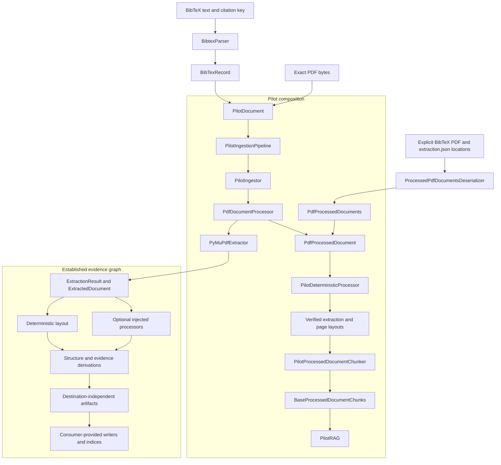
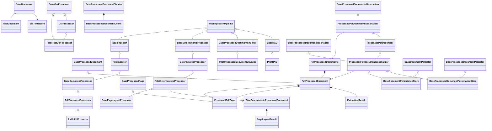
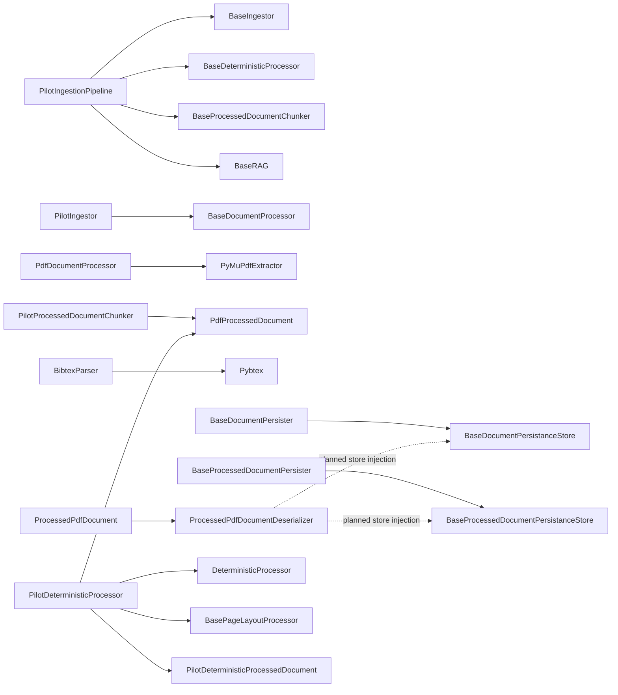

# Ingestion v0 Architecture

## Purpose

Ingestion v0 has an evidence-oriented extraction layer and a small pilot
composition layer. The pilot demonstrates an end-to-end PDF path without
replacing the richer extraction and deterministic-derivation graph.

## System Schematic

The pilot page-text projection and the richer evidence graph are sibling views
of the same cold extraction. The projection does not redefine or replace the
source-backed extraction result.

## Class Schematic

Each implemented component now has an abstract contract in its owning base
module or the shared `base.py`. OCR uses `ocr/processors/base.py`:
`TesseractOcrProcessor(BaseOcrProcessor)` owns the bounded backend adapter and
`OcrProcessor(BaseOcrProcessor)` encapsulates it. `PilotOcrProcessor` is the
intentional alias of `OcrProcessor`. `OcrProcessorIdentity`, `OcrRequest`, and
`OcrResult` are canonical; the uppercase spellings and
`TesseractOCRProcessor` remain warning-emitting
compatibility names only. Other examples include
`DeterministicLayoutProcessor(BasePageLayoutProcessor)` and
`DerivationAuditValidator(BaseDerivationAuditValidator)`.

## Dependency Schematic

## Persistence and deserialization design

Persistence is an injected, destination-independent write boundary. A persister
validates and serializes an owned contract; its store owns where the resulting
bytes and location evidence are retained.

- `BaseDocumentPersister` writes through
  `BaseDocumentPersistanceStore`. The store retains the exact original BibTeX
  source and exact PDF bytes. A persister must not reconstruct BibTeX from
  `BibTexRecord`, because that pilot projection intentionally omits parts of the
  source entry.
- `BaseProcessedDocumentPersister` writes through
  `BaseProcessedDocumentPersistanceStore`. The store retains the canonical,
  versioned `extraction.json` artifact and its location.
- `ProcessedPdfDocument` encapsulates the concrete
  `ProcessedPdfDocumentDeserializer`. The deserializer receives a citation key
  plus explicit BibTeX, PDF, and processed-document locations and reconstructs
  one verified `PdfProcessedDocument`. Store injection is the next persistence
  slice; the current concrete implementation still performs bounded file reads.
- `ProcessedPdfDocumentsDeserializer` preserves manifest order and returns
  `PdfProcessedDocuments`, which contains many `PdfProcessedDocument` values.

The base store stubs define location and byte access; they do not select a
concrete filesystem, database, object store, directory layout, or publication
policy.
Concrete stores remain injected deployment adapters. Neither stores nor
deserializers crawl directories, infer relationships from filenames, mutate
source files, or treat a locator as canonical document identity.

## Deterministic pilot composition design

Iteration two provides `BaseDeterministicProcessor`, the generic
`DeterministicProcessor` composition boundary, and the first executable
`PilotDeterministicProcessor` prefix. The pilot requires one
`PdfProcessedDocument` with retained extraction evidence, executes its injected
layout processor, and returns an immutable
`PilotDeterministicProcessedDocument` containing the exact extraction and one
ordered layout result per extracted page. Later ordered stages remain
unimplemented. `PdfProcessedDocuments` supplies the ordered corpus; future
corpus orchestration will process each contained document independently so a
failure cannot silently remove or alter another item.

Components are added only in this dependency order:

1. retain and verify the exact `ExtractionResult` already associated with the
   `PdfProcessedDocument`;
2. derive deterministic page layout;
3. derive article structure;
4. detect equation candidates;
5. detect and reconstruct tables;
6. detect figures;
7. compose structured transcription;
8. create clean transcript v2;
9. run the complete derivation audit; and
10. expose an audited, immutable corpus projection for downstream local-model
    training and evaluation.

Each implementation iteration is a validated prefix of this order. A later
stage cannot run or claim completion without its exact required predecessors.
Selective OCR and deterministic reconciliation enter after layout when source
quality requires them and before any downstream projection consumes reconciled
evidence. Equation recognition and other model-backed proposals remain optional
derived evidence after deterministic candidate detection.

Ingestion produces source-derived, audited corpus evidence. Local model
execution, embeddings, training eligibility, personalized note generation, and
human note acceptance remain downstream. Generated summaries, assessments, and
notes must not be fed back into the source-evidence corpus.

## Architectural Boundaries

- Shared pilot abstractions and immutable data contracts are owned by
  `base.py`.
- Pybtex is isolated behind the project-owned BibTeX facade.
- PyMuPDF is isolated behind the existing PDF adapter and composed only by the
  PDF document processor.
- The ingestor depends on a document-processor abstraction, not on PyMuPDF.
- The pipeline composes ingestion, the deterministic processing prefix,
  chunking, and answering without owning their algorithms.
- `PdfProcessedDocument` retains rich extraction evidence alongside its page-
  text projection for deterministic components.
- Corpus loading uses explicit BibTeX, PDF, and `extraction.json` locations;
  it performs no directory scanning or filename inference.
- Persisters own contract validation and serialization; injected persistance
  stores own byte retention and location resolution.
- Deterministic pilot composition follows one validated dependency order and
  retains every completed stage as immutable evidence.
- Search storage, bibliography mutation, destination rendering, and human
  acceptance remain outside this repository.

Concrete class behavior, module locations, test layout, and deferred pilot
limits are documented in [implementation.md](implementation.md).
