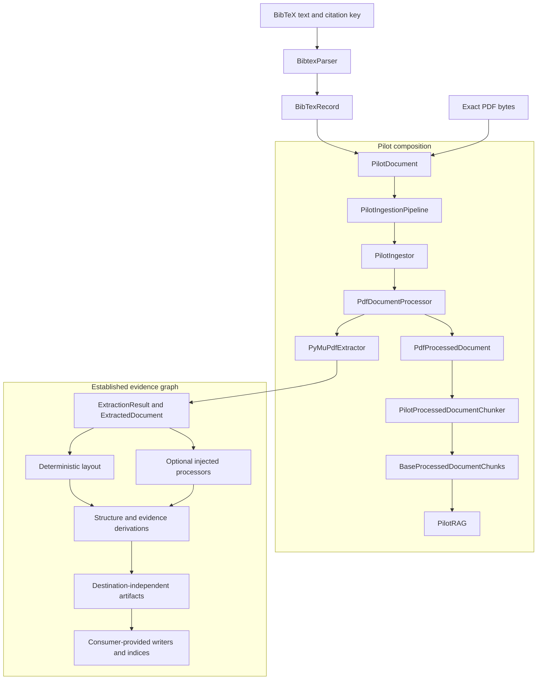
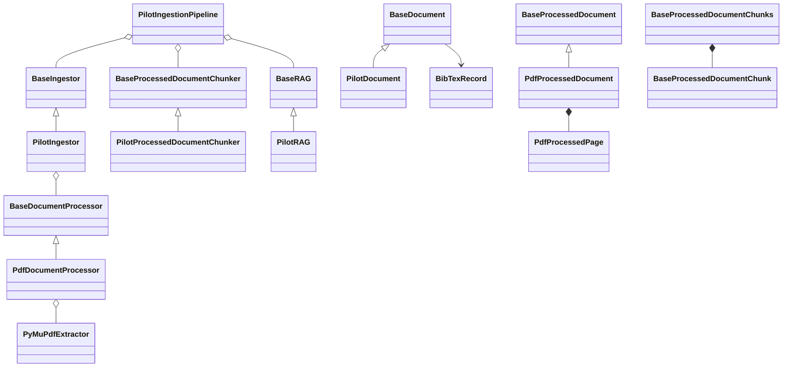
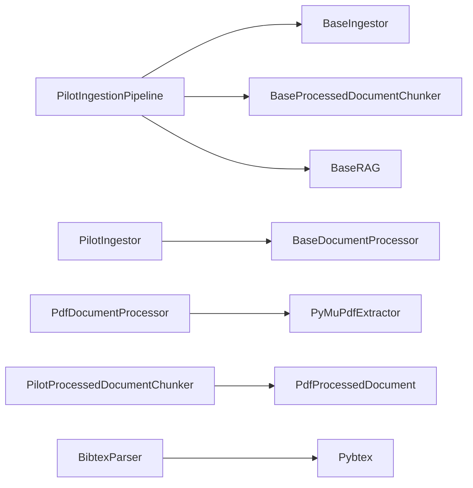

# Ingestion v0 Architecture

## Purpose

Ingestion v0 has an evidence-oriented extraction layer and a small pilot
composition layer. The pilot demonstrates an end-to-end PDF path without
replacing the richer extraction and deterministic-derivation graph.

## System Schematic

```mermaid
flowchart TD
    Citation[BibTeX text and citation key] --> BibtexParser
    BibtexParser --> BibTexRecord
    BibTexRecord --> PilotDocument
    Bytes[Exact PDF bytes] --> PilotDocument

    subgraph PilotComposition[Pilot composition]
        PilotDocument --> Pipeline[PilotIngestionPipeline]
        Pipeline --> Ingestor[PilotIngestor]
        Ingestor --> Processor[PdfDocumentProcessor]
        Processor --> Extractor[PyMuPdfExtractor]
        Processor --> Projection[PdfProcessedDocument]
        Projection --> Chunker[PilotProcessedDocumentChunker]
        Chunker --> Chunks[BaseProcessedDocumentChunks]
        Chunks --> RAG[PilotRAG]
    end

    Extractor --> Raw[ExtractionResult and ExtractedDocument]

    subgraph EvidenceGraph[Established evidence graph]
        Raw --> Layout[Deterministic layout]
        Raw --> Injected[Optional injected processors]
        Layout --> Derivations[Structure and evidence derivations]
        Injected --> Derivations
        Derivations --> Artifacts[Destination-independent artifacts]
        Artifacts --> Consumers[Consumer-provided writers and indices]
    end
```

The pilot page-text projection and the richer evidence graph are sibling views
of the same cold extraction. The projection does not redefine or replace the
source-backed extraction result.

## Class Schematic

```mermaid
classDiagram
    BaseDocument <|-- PilotDocument
    BaseProcessedDocument <|-- PdfProcessedDocument
    BaseDocumentProcessor <|-- PdfDocumentProcessor
    BaseIngestor <|-- PilotIngestor
    BaseProcessedDocumentChunker <|-- PilotProcessedDocumentChunker
    BaseRAG <|-- PilotRAG

    BaseDocument --> BibTexRecord
    PdfProcessedDocument *-- PdfProcessedPage
    BaseProcessedDocumentChunks *-- BaseProcessedDocumentChunk

    PilotIngestor o-- BaseDocumentProcessor
    PilotIngestionPipeline o-- BaseIngestor
    PilotIngestionPipeline o-- BaseProcessedDocumentChunker
    PilotIngestionPipeline o-- BaseRAG
    PdfDocumentProcessor o-- PyMuPdfExtractor
```

## Dependency Schematic

```mermaid
flowchart LR
    Pipeline[PilotIngestionPipeline] --> BaseIngestor
    Pipeline --> BaseChunker[BaseProcessedDocumentChunker]
    Pipeline --> BaseRAG
    PilotIngestor --> BaseProcessor[BaseDocumentProcessor]
    PdfProcessor[PdfDocumentProcessor] --> Extractor[PyMuPdfExtractor]
    PilotChunker[PilotProcessedDocumentChunker] --> PdfDocument[PdfProcessedDocument]
    BibtexParser --> Pybtex
```

## Architectural Boundaries

- Shared pilot abstractions and immutable data contracts are owned by
  `base.py`.
- Pybtex is isolated behind the project-owned BibTeX facade.
- PyMuPDF is isolated behind the existing PDF adapter and composed only by the
  PDF document processor.
- The ingestor depends on a document-processor abstraction, not on PyMuPDF.
- The pipeline composes ingestion, chunking, and answering without owning their
  algorithms.
- Rich extraction evidence remains available to deterministic components even
  though the pilot currently projects it to page text.
- Search storage, bibliography mutation, destination rendering, and human
  acceptance remain outside this repository.

Concrete class behavior, module locations, test layout, and deferred pilot
limits are documented in [implementation.md](implementation.md).
