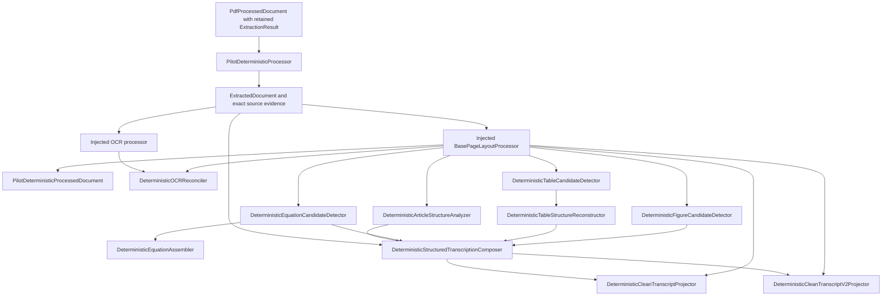

# Deterministic Ingestion v0

## Status

**Components implemented; first pilot composition prefix executable.**
Deterministic ingestion v0 is a family of bounded, independently versioned
components. `DeterministicProcessor` marks the generic ordering boundary and
remains a stub. `PilotDeterministicProcessor` now executes the validated
extraction-to-layout prefix without collapsing component contracts or identities.

See [architecture.md](architecture.md) for the component relationships and
[implementation.md](implementation.md) for the source and test map.

## Short Description

The deterministic components transform exact source-backed inputs into
immutable, inspectable derived evidence. For identical validated inputs,
component version, and configuration, a component produces the same ordered
result and stable identities. Raw evidence is retained; uncertainty remains an
explicit warning, exclusion, omission, failure, or low-confidence proposal.

Optional OCR and recognition implementations are injected boundaries. Their
outputs may be consumed as immutable evidence, but the v0 architecture does not
relabel a stochastic backend as deterministic.

`BaseDeterministicProcessor` and the `DeterministicProcessor` stub form the
iteration-two composition boundary. `PilotDeterministicProcessor` requires one
`PdfProcessedDocument` with retained extraction evidence and executes the first
canonical stage through an injected `BasePageLayoutProcessor`.

## Schematic

The pilot facade documented by [ingestion v0](../index.md) now runs the first
validated prefix of this graph. `PdfDocumentProcessor` projects and retains cold
extraction, and `PilotDeterministicProcessor` derives and retains page layout.
Later deterministic derivations remain explicit caller-selected stages until
their ordered prefixes are implemented.

## Key Classes

- **[`DeterministicLayoutProcessor`](layout/index.md)** — proposes page-local reading order and geometry-backed groups.
- **`DeterministicOCRReconciler`** — relates exact OCR and native-text evidence.
- **`DeterministicArticleStructureAnalyzer`** — proposes source-backed article structure.
- **`DeterministicEquationCandidateDetector`** and **`DeterministicEquationAssembler`** — detect and assemble equation evidence.
- **`DeterministicTableCandidateDetector`** and **`DeterministicTableStructureReconstructor`** — detect and reconstruct table evidence.
- **`DeterministicFigureCandidateDetector`** — retains source-backed figure candidates and associations.
- **`DeterministicStructuredTranscriptionComposer`** — composes typed evidence into an ordered transcript proposal.
- **`DeterministicCleanTranscriptProjector`** and **`DeterministicCleanTranscriptV2Projector`** — produce conservative clean projections.
- **`DerivationAuditValidator`** — deterministically validates retained provenance consistency.
- **`BaseDeterministicProcessor`** and **`DeterministicProcessor`** — shared
  contract and generic composition-root stub.
- **`PilotDeterministicProcessor`** — executable extraction-to-layout prefix
  producing `PilotDeterministicProcessedDocument`.
