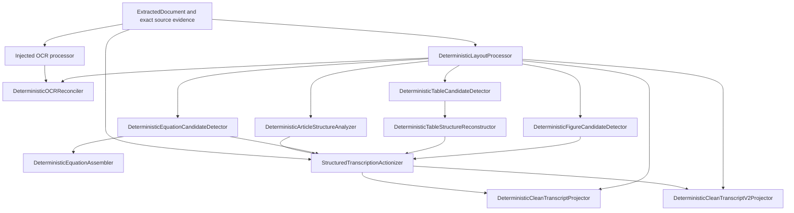

# Deterministic Ingestion v0

## Status

**Current and implemented.** Deterministic ingestion v0 is a family of bounded,
independently versioned components. It is not a class named
`DeterministicProcessor`.

See [architecture.md](architecture.md) for the component relationships and
[implementation.md](implementation.md) for the source and test map.

## Short Description

The deterministic components transform exact source-backed inputs into
immutable, inspectable derived evidence. For identical validated inputs,
component version, and configuration, a component produces the same ordered
result and stable identities. Raw evidence is retained; uncertainty remains an
explicit warning, exclusion, omission, failure, or low-confidence proposal.

Optional OCR and recognition implementations are injected boundaries. Their
outputs may be consumed as immutable evidence, but the v0 architecture does not
relabel a stochastic backend as deterministic.

## Schematic

```mermaid
flowchart TD
    Raw[ExtractedDocument and exact source evidence]

    Raw --> Layout[DeterministicLayoutProcessor]
    Raw --> OCR[Injected OCR processor]
    OCR --> Reconcile[DeterministicOCRReconciler]
    Layout --> Reconcile

    Layout --> Structure[DeterministicArticleStructureAnalyzer]
    Layout --> Equations[DeterministicEquationCandidateDetector]
    Layout --> Tables[DeterministicTableCandidateDetector]
    Layout --> Figures[DeterministicFigureCandidateDetector]

    Equations --> EquationAssembly[DeterministicEquationAssembler]
    Tables --> TableStructure[DeterministicTableStructureReconstructor]

    Raw --> Compose[StructuredTranscriptionActionizer]
    Structure --> Compose
    Equations --> Compose
    TableStructure --> Compose
    Figures --> Compose

    Compose --> CleanV1[DeterministicCleanTranscriptProjector]
    Compose --> CleanV2[DeterministicCleanTranscriptV2Projector]
    Layout --> CleanV1
    Layout --> CleanV2
```

The pilot facade documented by [ingestion v0](../index.md) does not implicitly
run this graph. `PdfDocumentProcessor` currently projects cold extraction to
page text; deterministic derivations remain explicit caller-selected stages.

## Key Classes

- **[`DeterministicLayoutProcessor`](layout/index.md)** — proposes page-local reading order and geometry-backed groups.
- **`DeterministicOCRReconciler`** — relates exact OCR and native-text evidence.
- **`DeterministicArticleStructureAnalyzer`** — proposes source-backed article structure.
- **`DeterministicEquationCandidateDetector`** and **`DeterministicEquationAssembler`** — detect and assemble equation evidence.
- **`DeterministicTableCandidateDetector`** and **`DeterministicTableStructureReconstructor`** — detect and reconstruct table evidence.
- **`DeterministicFigureCandidateDetector`** — retains source-backed figure candidates and associations.
- **`StructuredTranscriptionActionizer`** — composes typed evidence into an ordered transcript proposal.
- **`DeterministicCleanTranscriptProjector`** and **`DeterministicCleanTranscriptV2Projector`** — produce conservative clean projections.
- **`DerivationAuditValidator`** — deterministically validates retained provenance consistency.
