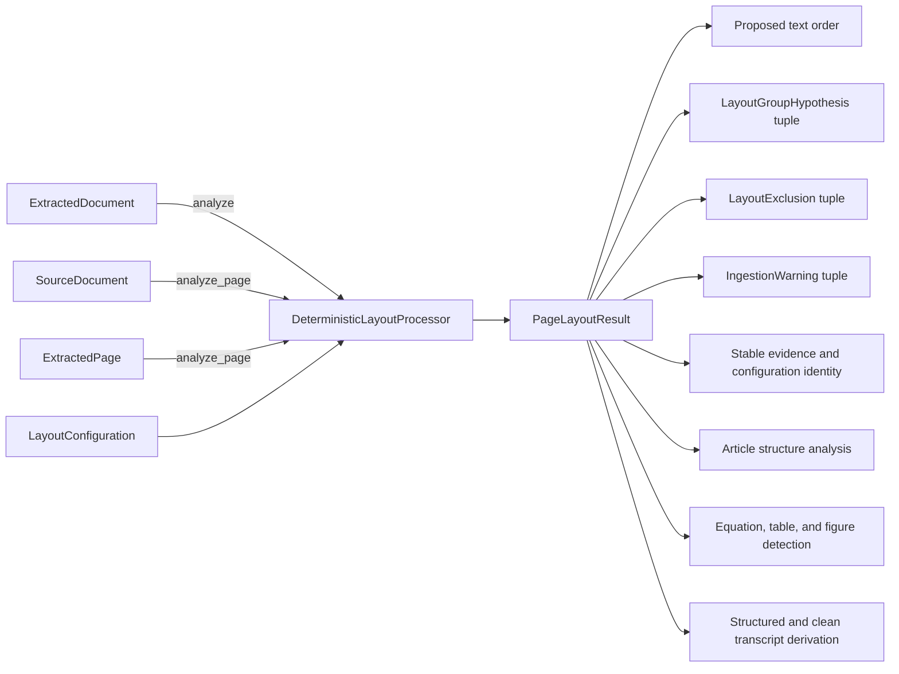

# Deterministic Page-Layout Processor

## Status

**Implemented.** The public implementation is
[`DeterministicLayoutProcessor`](../../../../../../src/python/projectkoios/ingestion/layout.py),
with layout contract version `1.0`, processor name
`deterministic-page-layout`, and processor version `2`.

Validation is maintained in the focused
[`DeterministicLayoutProcessor` test suite](../../../../../../tests/test__DeterministicLayoutProcessor.py).

## Short Description

The deterministic page-layout processor converts the exact geometric evidence
of each `ExtractedPage` into an immutable `PageLayoutResult`. It proposes a
page-local text reading order and geometry-backed groups without modifying or
replacing the extractor-native block sequence.

The processor recognizes conservative one- and two-column hypotheses, spanning
headings, possible bottom matter, sidebars, and uncertain groups. Missing or
invalid text geometry is explicitly excluded. Overlap, unsupported rotation,
weak separation, and complex geometry produce warnings and low-confidence
ambiguity rather than a fabricated confident order. The processor performs no
OCR, model calls, semantic interpretation, document-wide ordering, publication,
or filesystem mutation.

## Schematic

Downstream structure analysis, candidate detection, and transcript derivation
consume the retained `PageLayoutResult`; they do not reconstruct layout evidence
from page text.

## Key Classes

All processor-owned classes are defined in
[`src/python/projectkoios/ingestion/layout.py`](../../../../../../src/python/projectkoios/ingestion/layout.py).

- **`DeterministicLayoutProcessor`** — validates bounded page evidence and
  provides `analyze(document)` and `analyze_page(source, page)` entry points.
- **`LayoutConfiguration`** — immutable resource limits and geometry
  thresholds. Its complete value contributes to `configuration_digest`.
- **`PageLayoutResult`** — immutable output containing exact source/page
  identity, raw block references, proposed order, exclusions, groups, warnings,
  confidence, processor identity, and stable result identity.
- **`LayoutBlockReference`** — non-owning source-backed projection of one raw
  text block and its source spans.
- **`LayoutExclusion`** — records why a text block could not participate in the
  proposed order and retains supporting evidence.
- **`LayoutGroupHypothesis`** — records one exclusive geometry-backed group,
  its union bounding box, confidence, evidence, and warning links.
- **`LayoutPageKind`** — page hypotheses: `empty`, `one_column`,
  `multi_column`, or `ambiguous`.
- **`LayoutGroupKind`** — group hypotheses: `one_column`, `column`,
  `spanning_heading`, `footnote_candidate`, `sidebar`, or `uncertain`.
- **`LayoutAnalysisLimitError`** — raised before pair analysis when configured
  page-complexity bounds are exceeded.
