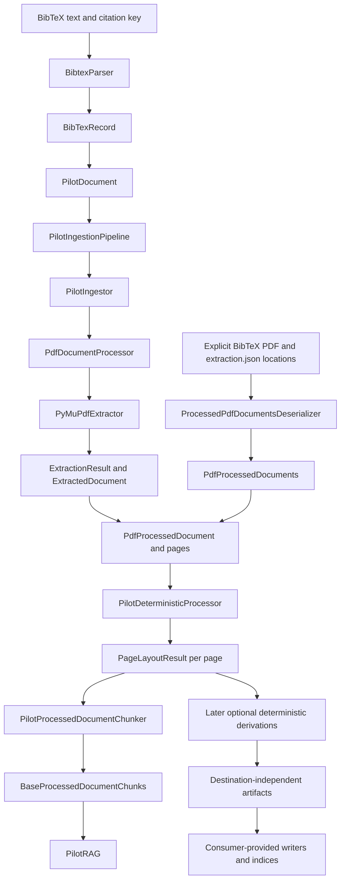

# Ingestion Architecture v0

## Status

**Current and implemented.** Ingestion v0 contains the established
source-evidence pipeline and a deliberately small pilot composition facade. The
pilot exercises one complete path from a BibTeX-backed PDF through retained
extraction evidence and deterministic page layout to character chunks and
lexical retrieval without replacing the richer extraction contracts.

Detailed boundaries and deferred limitations are in
[architecture.md](architecture.md). Class locations and validation entry points
are in [implementation.md](implementation.md). The existing
[long-form architecture aggregate](../../../architecture.md) remains the
complete detailed record for established components not restated in these
versioned overview pages.

## Schematic

`PilotIngestionPipeline` composes the ingestor, deterministic processor,
chunker, and RAG boundary. Its `ingest()` method extracts one document, derives
the validated layout prefix, stores the resulting chunks, and returns them.
Answering remains owned by `PilotRAG`.

Iteration two provides separate persister/store contract stubs and strict
read-side deserializers for exact BibTeX, PDF, and `extraction.json` evidence. It
also adds the
`BaseDeterministicProcessor → DeterministicProcessor → PilotDeterministicProcessor`
composition path. The pilot processor now verifies retained extraction evidence
and executes the layout prefix; `PdfProcessedDocuments` supplies an ordered
corpus of source documents for future corpus orchestration.

## Main Boundaries

- [`base.py`](../../../../src/python/projectkoios/ingestion/base.py) owns the
  shared v0 document, processing, ingestion, chunking, and RAG abstractions.
- [`bibtex.py`](../../../../src/python/projectkoios/ingestion/bibtex.py) owns the
  citation facade and is the only pilot module that imports Pybtex.
- [`documents/pdf/`](../../../../src/python/projectkoios/ingestion/documents/pdf/)
  owns PDF processing, strict single-document and corpus deserialization, and
  the explicit location manifest while encapsulating `PyMuPdfExtractor`.
- [`pilot/`](../../../../src/python/projectkoios/ingestion/pilot/) owns the thin
  composition, page-character chunking policy, and lexical answer behavior.
- [`pdf/`](../../../../src/python/projectkoios/ingestion/pdf/) retains the richer
  cold-extraction contracts used by existing ingestion and deterministic
  derivations.
- [Deterministic ingestion v0](deterministic/index.md) documents the bounded
  source-backed derivation family and ordered pilot composition. The current
  pilot invokes extraction verification and page layout only.

## Deliberate Pilot Limits

The pilot is single-document and citation-first. It projects rich PDF evidence
to page text, uses fixed-size character chunks, keeps mutable last-run chunks on
the pipeline, and returns a lexical source chunk rather than generated text.
These limits apply only to the bounded pilot. Their objective revisit
conditions are recorded in the
[implementation guide](implementation.md#deferred-pilot-limits); any durable
cross-repository architecture decision remains owned by `projectkoios`.
