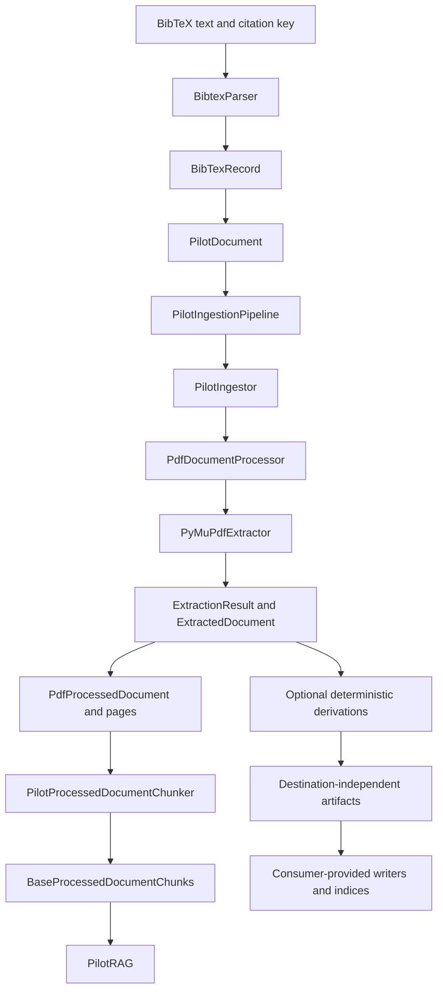

# Ingestion Architecture v0

## Status

**Current and implemented.** Ingestion v0 contains the established
source-evidence pipeline and a deliberately small pilot composition facade. The
pilot exercises one complete path from a BibTeX-backed PDF to page text,
character chunks, and lexical retrieval without replacing the richer extraction
contracts.

Detailed boundaries and deferred limitations are in
[architecture.md](architecture.md). Class locations and validation entry points
are in [implementation.md](implementation.md).

## Schematic

```mermaid
flowchart TD
    BibTeX[BibTeX text and citation key] --> BibtexParser
    BibtexParser --> BibTexRecord
    BibTexRecord --> PilotDocument

    PilotDocument --> PilotPipeline[PilotIngestionPipeline]
    PilotPipeline --> PilotIngestor
    PilotIngestor --> PdfProcessor[PdfDocumentProcessor]
    PdfProcessor --> PdfExtractor[PyMuPdfExtractor]
    PdfExtractor --> Extraction[ExtractionResult and ExtractedDocument]
    Extraction --> PdfProcessed[PdfProcessedDocument and pages]
    PdfProcessed --> Chunker[PilotProcessedDocumentChunker]
    Chunker --> Chunks[BaseProcessedDocumentChunks]
    Chunks --> PilotRAG

    Extraction --> Deterministic[Optional deterministic derivations]
    Deterministic --> Artifacts[Destination-independent artifacts]
    Artifacts --> Consumers[Consumer-provided writers and indices]
```

`PilotIngestionPipeline` composes the ingestor, chunker, and RAG boundary. Its
`ingest()` method processes one document, stores the resulting chunks, and
returns them. Answering remains owned by `PilotRAG`.

## Main Boundaries

- [`base.py`](../../../../src/python/projectkoios/ingestion/base.py) owns the
  shared v0 document, processing, ingestion, chunking, and RAG abstractions.
- [`bibtex.py`](../../../../src/python/projectkoios/ingestion/bibtex.py) owns the
  citation facade and is the only pilot module that imports Pybtex.
- [`documents/pdf.py`](../../../../src/python/projectkoios/ingestion/documents/pdf.py)
  owns PDF processing and encapsulates `PyMuPdfExtractor`.
- [`pilot/`](../../../../src/python/projectkoios/ingestion/pilot/) owns the thin
  composition, page-character chunking policy, and lexical answer behavior.
- [`pdf/`](../../../../src/python/projectkoios/ingestion/pdf/) retains the richer
  cold-extraction contracts used by existing ingestion and deterministic
  derivations.
- [Deterministic ingestion v0](deterministic/index.md) documents the bounded
  source-backed derivation family. The pilot does not yet invoke those stages.

## Deliberate Pilot Limits

The pilot is single-document and citation-first. It projects rich PDF evidence
to page text, uses fixed-size character chunks, keeps mutable last-run chunks on
the pipeline, and returns a lexical source chunk rather than generated text.
These limits are accepted only for the bounded pilot. Their evidence,
consequences, and objective revisit conditions are recorded as
`INGESTION-PILOT-001` through `INGESTION-PILOT-005` in
`projectkoios/docs/development/software-review.md`.
