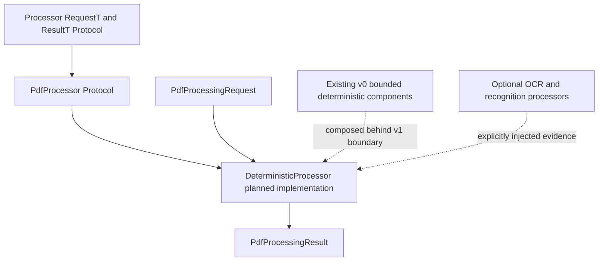

# Deterministic PDF Processor (v1)

## Status

**Proposed.** Project Koios ingestion currently implements the v0 architecture.
The v1 `Processor`, `PdfProcessor`, and `DeterministicProcessor` abstractions do
not yet exist in source code.

The existing v0 deterministic components remain the implementation evidence
from which this v1 composition boundary will be designed. Component contract
and processor versions are independent of the v0/v1 architecture version.

## Short Description

The v1 design introduces a generic `Processor` protocol with one typed
`process(request) -> result` operation. `PdfProcessor` specializes that contract
for immutable PDF processing requests and results. `DeterministicProcessor` is
the planned concrete PDF implementation that composes the existing bounded v0
stages behind one explicit entry point.

The v1 boundary must preserve the current evidence rules: exact source
identity, immutable intermediate results, complete processor and configuration
identity, explicit uncertainty, bounded execution, and no hidden publication.
It must not turn optional OCR or recognition backends into deterministic claims.

## Schematic



## Key Classes

The proposed type shape is:

```python
from typing import Protocol, TypeVar

RequestT = TypeVar("RequestT", contravariant=True)
ResultT = TypeVar("ResultT", covariant=True)


class Processor(Protocol[RequestT, ResultT]):
    name: str
    version: str

    def process(self, request: RequestT) -> ResultT: ...


class PdfProcessor(
    Processor["PdfProcessingRequest", "PdfProcessingResult"],
    Protocol,
):
    pass


class DeterministicProcessor(PdfProcessor):
    def process(
        self,
        request: "PdfProcessingRequest",
    ) -> "PdfProcessingResult": ...
```

- **`Processor[RequestT, ResultT]`** — generic structural contract shared by
  processing implementations.
- **`PdfProcessor`** — PDF-specific protocol binding the generic operation to
  `PdfProcessingRequest` and `PdfProcessingResult`.
- **`DeterministicProcessor`** — planned v1 implementation and composition root
  for deterministic PDF ingestion.
- **`PdfProcessingRequest`** — planned immutable request carrying exact source,
  content, configuration, selections, and explicitly injected optional
  processors.
- **`PdfProcessingResult`** — planned immutable aggregate retaining exact raw
  extraction and every requested derived result, warning, omission, failure,
  and processor/configuration identity.
- **`ProcessingProcessor`** — existing v0 bounded-work-item adapter; it remains
  narrower than the proposed top-level `Processor` and is not implicitly
  renamed.

Current implementation references:

- [v0 ingestion architecture](../../v0/architecture.md)
- [v0 deterministic layout processor](../../v0/deterministic/layout/index.md)
