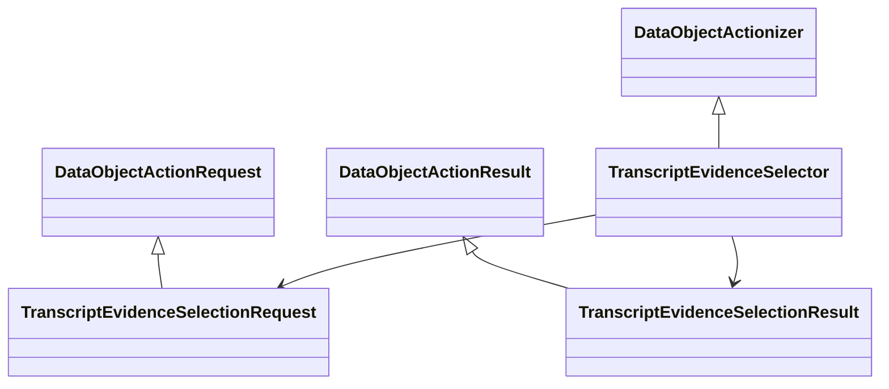

# `projectkoios` namespace implementation

The distribution discovers the `projectkoios` PEP 420 namespace beneath
`src/python`. Shared `DataObjectActionRequest`, `DataObjectActionResult`, and
`DataObjectActionizer` bases come from the pinned `projectkoios` dependency;
this repository implements ingestion-owned specializations.

Public ingestion exports are collected by
`src/python/projectkoios/ingestion/__init__.py`; the namespace root remains
implicit.
