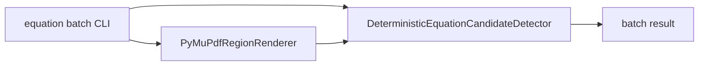

# `ingestion.equation_batch_cli` schematic

```mermaid
flowchart LR
    CLI["equation batch CLI"]
    Adapter["PyMuPdfRegionRenderer"]
    Detector["DeterministicEquationCandidateDetector"]
    Output["batch result"]

    CLI --> Adapter
    CLI --> Detector
    Adapter --> Detector
    Detector --> Output
```

Concrete adapter construction is confined to this composition boundary.
