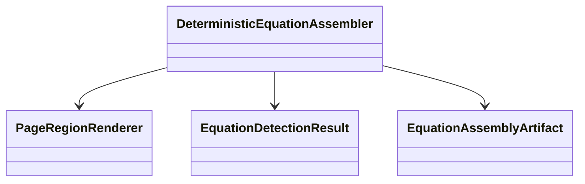

# `DeterministicEquationAssembler` schematic

```mermaid
classDiagram
    class DeterministicEquationAssembler
    class PageRegionRenderer
    class EquationDetectionResult
    class EquationAssemblyArtifact

    DeterministicEquationAssembler --> PageRegionRenderer
    DeterministicEquationAssembler --> EquationDetectionResult
    DeterministicEquationAssembler --> EquationAssemblyArtifact
```

Rendering is an injected capability, not assembler-owned composition.
