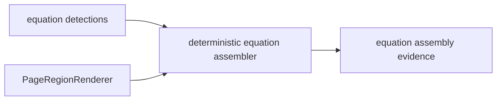

# `ingestion.equation_enrichment` schematic

```mermaid
flowchart LR
    Detections["equation detections"]
    Renderer["PageRegionRenderer"]
    Assembler["deterministic equation assembler"]
    Assemblies["equation assembly evidence"]

    Detections --> Assembler
    Renderer --> Assembler
    Assembler --> Assemblies
```

The caller composes the renderer before assembly begins.
