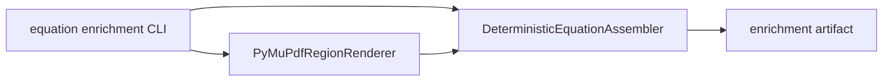

# `ingestion.equation_enrichment_cli` schematic

```mermaid
flowchart LR
    CLI["equation enrichment CLI"]
    Adapter["PyMuPdfRegionRenderer"]
    Assembler["DeterministicEquationAssembler"]
    Output["enrichment artifact"]

    CLI --> Adapter
    CLI --> Assembler
    Adapter --> Assembler
    Assembler --> Output
```

The neutral assembler receives an already selected concrete capability.
