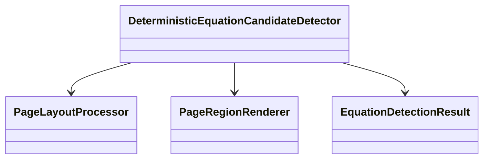

# `DeterministicEquationCandidateDetector` schematic

```mermaid
classDiagram
    class DeterministicEquationCandidateDetector
    class PageLayoutProcessor
    class PageRegionRenderer
    class EquationDetectionResult

    DeterministicEquationCandidateDetector --> PageLayoutProcessor
    DeterministicEquationCandidateDetector --> PageRegionRenderer
    DeterministicEquationCandidateDetector --> EquationDetectionResult
```

The detector owns equation policy but not renderer composition.
