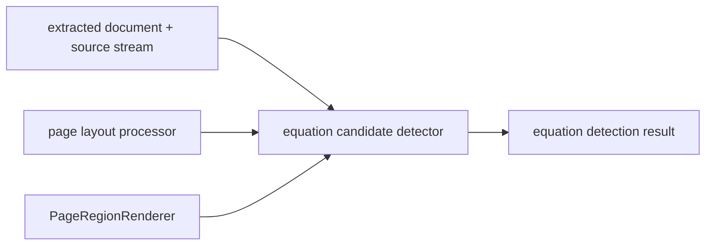

# `ingestion.equations` schematic

```mermaid
flowchart LR
    Document["extracted document + source stream"]
    Layout["page layout processor"]
    Renderer["PageRegionRenderer"]
    Detector["equation candidate detector"]
    Result["equation detection result"]

    Document --> Detector
    Layout --> Detector
    Renderer --> Detector
    Detector --> Result
```

Concrete renderer selection remains outside equation detection.
