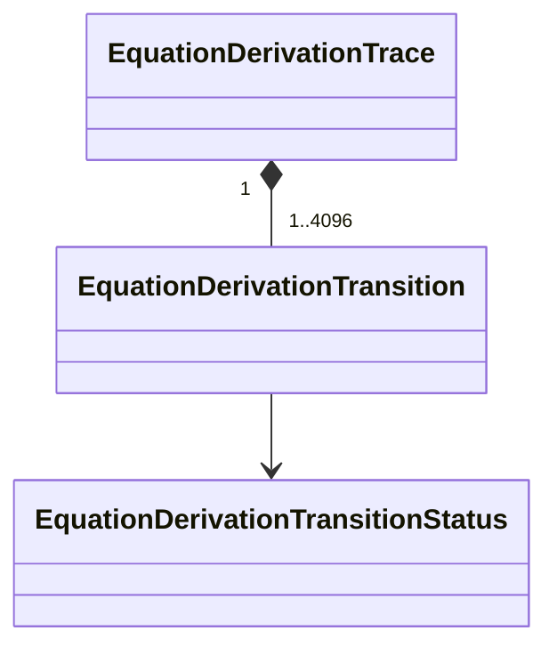
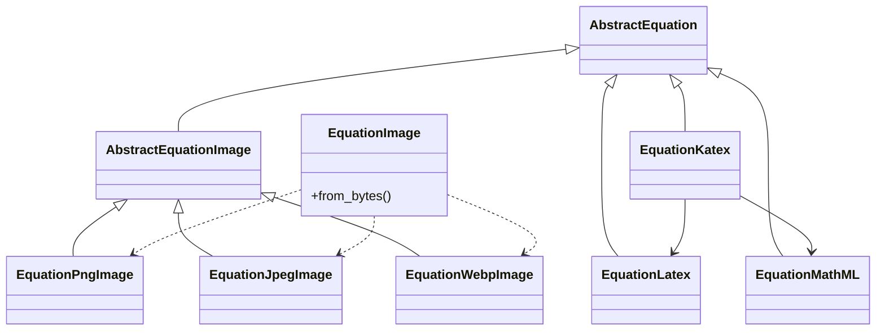

# `ingestion.equations` schematic

```mermaid
classDiagram
    class EquationDerivationTrace
    class EquationDerivationTransition
    class EquationDerivationTransitionStatus
    EquationDerivationTrace "1" *-- "1..4096" EquationDerivationTransition
    EquationDerivationTransition --> EquationDerivationTransitionStatus
```

```mermaid
classDiagram
    class AbstractEquation
    class AbstractEquationImage
    class EquationPngImage
    class EquationJpegImage
    class EquationWebpImage
    class EquationLatex
    class EquationMathML
    class EquationKatex
    class EquationImage {
        +from_bytes()
    }

    AbstractEquation <|-- AbstractEquationImage
    AbstractEquation <|-- EquationLatex
    AbstractEquation <|-- EquationMathML
    AbstractEquation <|-- EquationKatex
    AbstractEquationImage <|-- EquationPngImage
    AbstractEquationImage <|-- EquationJpegImage
    AbstractEquationImage <|-- EquationWebpImage
    EquationImage ..> EquationPngImage
    EquationImage ..> EquationJpegImage
    EquationImage ..> EquationWebpImage
    EquationKatex --> EquationLatex
    EquationKatex --> EquationMathML
```

The convenience factory returns concrete nominal image values. It is neither a
persisted representation nor a workflow token.
