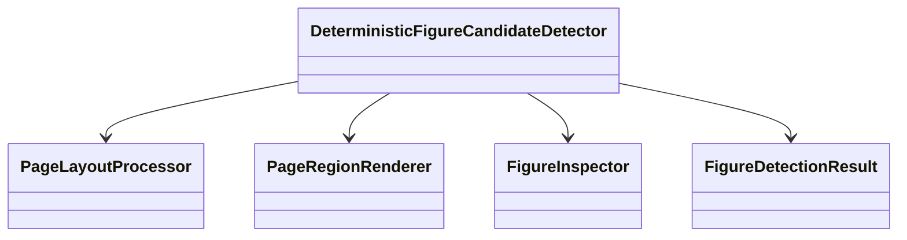

# `DeterministicFigureCandidateDetector` schematic

```mermaid
classDiagram
    class DeterministicFigureCandidateDetector
    class PageLayoutProcessor
    class PageRegionRenderer
    class FigureInspector
    class FigureDetectionResult

    DeterministicFigureCandidateDetector --> PageLayoutProcessor
    DeterministicFigureCandidateDetector --> PageRegionRenderer
    DeterministicFigureCandidateDetector --> FigureInspector
    DeterministicFigureCandidateDetector --> FigureDetectionResult
```

The detector owns figure policy but not concrete renderer selection.
