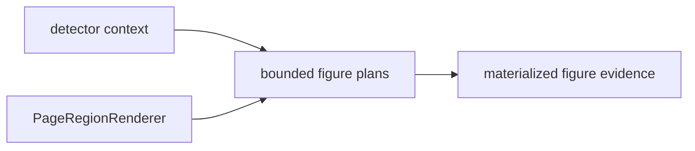

# `figures.detection` schematic

```mermaid
flowchart LR
    Context["detector context"]
    Renderer["PageRegionRenderer"]
    Plans["bounded figure plans"]
    Results["materialized figure evidence"]

    Context --> Plans
    Renderer --> Plans
    Plans --> Results
```

The context's renderer is nominally typed and supplied before detection.
