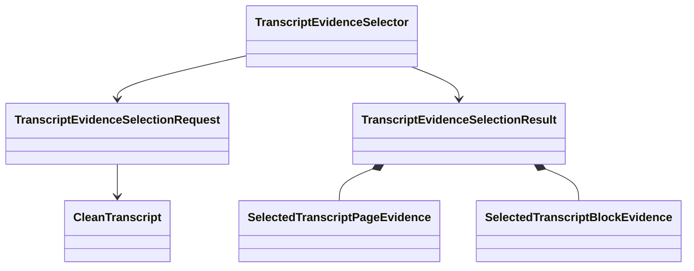

# `projectkoios.ingestion` touched-slice implementation

`projectkoios.ingestion.__init__` exports the selection request, outcome,
selected evidence records, result, limit error, mapping basis, and semantic
selector. The implementation is owned by the unversioned
`transcript.evidence.selection` package and depends only on the existing
canonical [`CleanTranscript`](../../../contracts/clean-transcript.md) family.

The package initializer intentionally exposes the canonical selection classes.
Selection policy, bounds, completeness checks, warning resolution, ordering,
and identities remain owned by the nested package.
