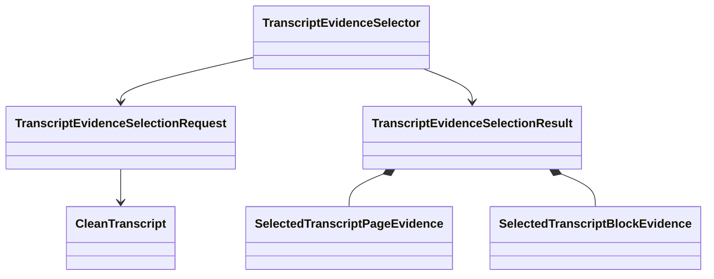

# `projectkoios.ingestion` touched-slice implementation

`projectkoios.ingestion.__init__` exports the selection request, outcome,
selected evidence records, result, limit error, mapping basis, and semantic
selector. The implementation remains in the unversioned
`transcript_evidence_selection.py` module and depends only on the existing
canonical [`CleanTranscript`](../../../contracts/clean-transcript.md) family.

The package initializer adds aliases only. Selection policy, bounds,
completeness checks, warning resolution, ordering, and identities remain owned
by the module.
