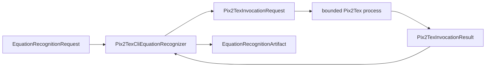

# Pix2Tex integration schematic

```mermaid
flowchart LR
    NeutralRequest["EquationRecognitionRequest"]
    Adapter["Pix2TexCliEquationRecognizer"]
    InvocationRequest["Pix2TexInvocationRequest"]
    Process["bounded Pix2Tex process"]
    InvocationResult["Pix2TexInvocationResult"]
    NeutralResult["EquationRecognitionArtifact"]

    NeutralRequest --> Adapter
    Adapter --> InvocationRequest
    InvocationRequest --> Process
    Process --> InvocationResult
    InvocationResult --> Adapter
    Adapter --> NeutralResult
```

The repository composition root selects this adapter. The engine-neutral
workflow sees only the abstract recognizer and neutral request/result classes.
