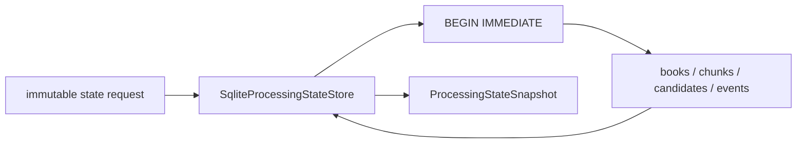

# SQLite processing-state schematic

```mermaid
flowchart LR
    Request["immutable state request"]
    Adapter["SqliteProcessingStateStore"]
    Transaction["BEGIN IMMEDIATE"]
    Tables["books / chunks / candidates / events"]
    Snapshot["ProcessingStateSnapshot"]

    Request --> Adapter
    Adapter --> Transaction
    Transaction --> Tables
    Tables --> Adapter
    Adapter --> Snapshot
```

Raw SQL and SQLite runtime objects terminate at the adapter boundary.
