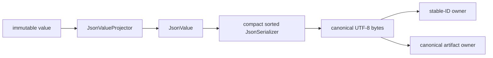

# `json.canonical` schematic

```mermaid
flowchart LR
    Input["immutable value"]
    Projector["JsonValueProjector"]
    Value["JsonValue"]
    Serializer["compact sorted JsonSerializer"]
    Bytes["canonical UTF-8 bytes"]
    Identity["stable-ID owner"]
    Artifact["canonical artifact owner"]

    Input --> Projector --> Value --> Serializer --> Bytes
    Bytes --> Identity
    Bytes --> Artifact
```

Canonical JSON owns deterministic bytes only. Hashing, identity namespaces, and
artifact publication remain with their semantic owners.
