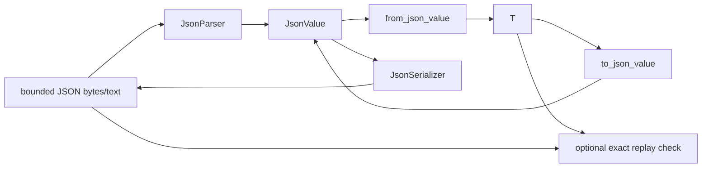

# `json.contract` schematic

```mermaid
flowchart LR
    Bytes["bounded JSON bytes/text"]
    Parser["JsonParser"]
    Value["JsonValue"]
    Decode["from_json_value"]
    Record["T"]
    Encode["to_json_value"]
    Serializer["JsonSerializer"]
    Replay["optional exact replay check"]

    Bytes --> Parser --> Value --> Decode --> Record
    Record --> Encode --> Value --> Serializer --> Bytes
    Record --> Replay
    Bytes --> Replay
```

The concrete contract owns schema mapping; the generic class owns the bounded
parse/serialize lifecycle.
