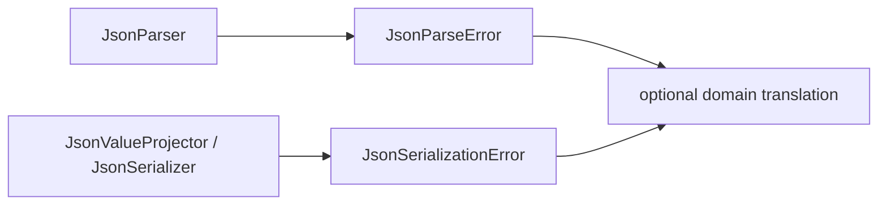

# `json.error` schematic

```mermaid
flowchart LR
    Parse["JsonParser"]
    Serialize["JsonValueProjector / JsonSerializer"]
    ParseError["JsonParseError"]
    SerializationError["JsonSerializationError"]
    Domain["optional domain translation"]

    Parse --> ParseError --> Domain
    Serialize --> SerializationError --> Domain
```

Limit exhaustion follows the separate `JsonLimitError` path.
