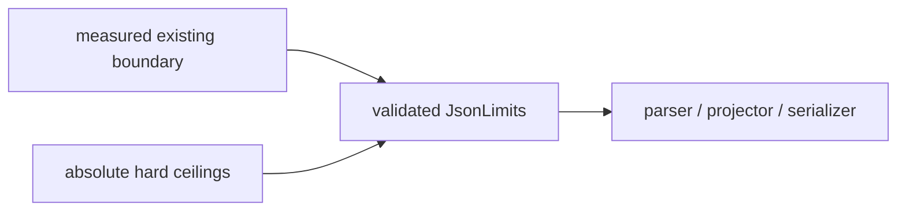

# `json.limits.definition` schematic

```mermaid
flowchart LR
    Existing["measured existing boundary"]
    Hard["absolute hard ceilings"]
    Limits["validated JsonLimits"]
    Consumer["parser / projector / serializer"]

    Existing --> Limits
    Hard --> Limits
    Limits --> Consumer
```

The domain selects explicit lower ceilings; the generic definition prevents an
unbounded or structurally inconsistent configuration.
