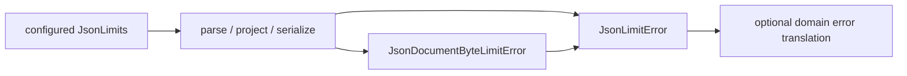

# `json.limits.error` schematic

```mermaid
flowchart LR
    Boundary["configured JsonLimits"]
    Operation["parse / project / serialize"]
    Error["JsonLimitError"]
    ByteError["JsonDocumentByteLimitError"]
    Domain["optional domain error translation"]

    Boundary --> Operation
    Operation --> Error
    Operation --> ByteError --> Error
    Error --> Domain
```

Rejected payload content is not embedded in the generic error.
