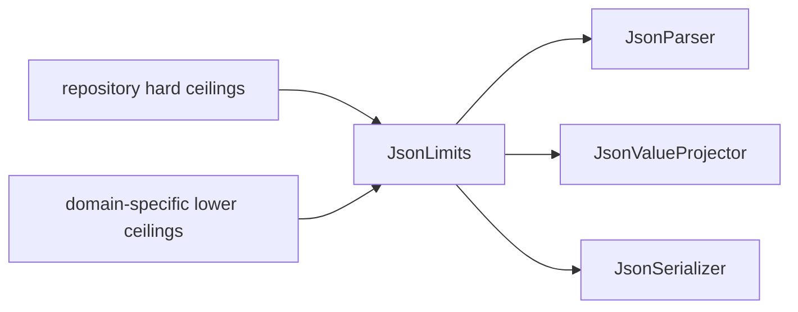

# `json.limits` schematic

```mermaid
flowchart LR
    Hard["repository hard ceilings"]
    Domain["domain-specific lower ceilings"]
    Limits["JsonLimits"]
    Parser["JsonParser"]
    Projector["JsonValueProjector"]
    Serializer["JsonSerializer"]

    Hard --> Limits
    Domain --> Limits
    Limits --> Parser
    Limits --> Projector
    Limits --> Serializer
```

Every external JSON boundary is explicitly bounded; no parser receives an
unlimited default.
