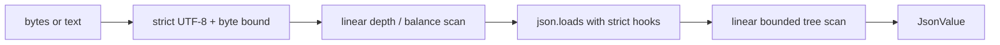

# `json.parser` schematic

```mermaid
flowchart LR
    Payload["bytes or text"]
    UTF8["strict UTF-8 + byte bound"]
    Lexical["linear depth / balance scan"]
    Stdlib["json.loads with strict hooks"]
    Tree["linear bounded tree scan"]
    Value["JsonValue"]

    Payload --> UTF8 --> Lexical --> Stdlib --> Tree --> Value
```

No domain reconstruction occurs until the complete JSON tree satisfies generic
resource and value constraints.
