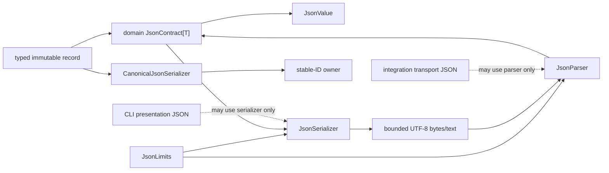

# `projectkoios.ingestion.json` schematic

A domain JSON contract owns record-specific field schema and reconstruction.
The generic package owns bounded JSON mechanics. CLI presentation and backend
transport may reuse those mechanics without being misclassified as durable
record contracts.
