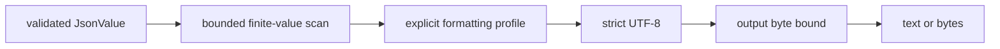

# `json.serializer` schematic

```mermaid
flowchart LR
    Value["validated JsonValue"]
    Validation["bounded finite-value scan"]
    Format["explicit formatting profile"]
    UTF8["strict UTF-8"]
    Bound["output byte bound"]
    Output["text or bytes"]

    Value --> Validation --> Format --> UTF8 --> Bound --> Output
```

Formatting is explicit and deterministic; the serializer performs no record
projection or publication.
