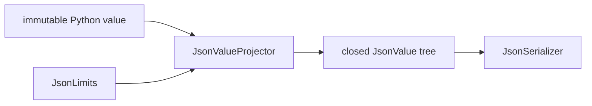

# `json.value` schematic

```mermaid
flowchart LR
    Input["immutable Python value"]
    Bounds["JsonLimits"]
    Projector["JsonValueProjector"]
    Value["closed JsonValue tree"]
    Serializer["JsonSerializer"]

    Input --> Projector
    Bounds --> Projector
    Projector --> Value --> Serializer
```

Projection closes the value domain before formatting or hashing. It does not
parse external JSON text.
