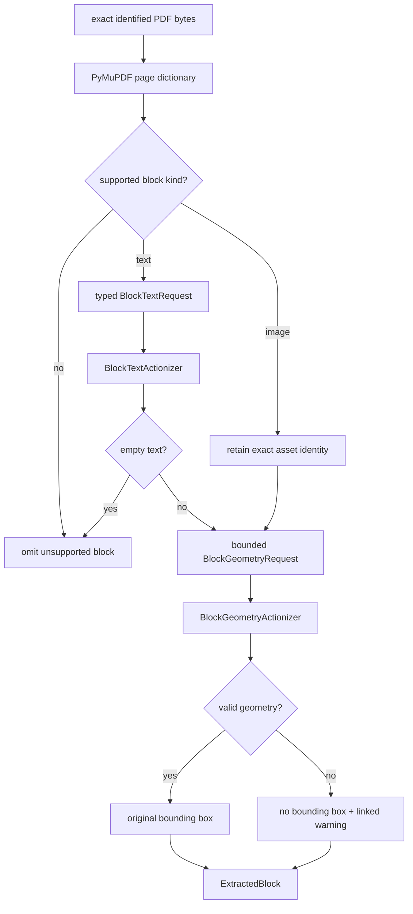

# `PyMuPdfExtractor` schematic

```mermaid
flowchart TD
    Bytes["exact identified PDF bytes"] --> Page["PyMuPDF page dictionary"]
    Page --> Kind{"supported block kind?"}
    Kind -- no --> Omit["omit unsupported block"]
    Kind -- text --> TextRequest["typed BlockTextRequest"]
    TextRequest --> TextAction["BlockTextActionizer"]
    TextAction --> Empty{"empty text?"}
    Empty -- yes --> Omit
    Empty -- no --> GeometryRequest["bounded BlockGeometryRequest"]
    Kind -- image --> Asset["retain exact asset identity"]
    Asset --> GeometryRequest
    GeometryRequest --> GeometryAction["BlockGeometryActionizer"]
    GeometryAction --> Valid{"valid geometry?"}
    Valid -- yes --> Box["original bounding box"]
    Valid -- no --> Missing["no bounding box + linked warning"]
    Box --> Block["ExtractedBlock"]
    Missing --> Block
```
