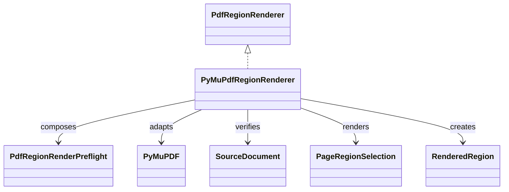

# `PyMuPdfRegionRenderer` schematic

```mermaid
classDiagram
    class SourceDocument
    class PageRegionSelection
    class PdfRegionRenderer
    class PdfRegionRenderPreflight
    class PyMuPdfRegionRenderer
    class RenderedRegion
    class PyMuPDF

    PdfRegionRenderer <|.. PyMuPdfRegionRenderer
    PyMuPdfRegionRenderer --> PdfRegionRenderPreflight : composes
    PyMuPdfRegionRenderer --> PyMuPDF : adapts
    PyMuPdfRegionRenderer --> SourceDocument : verifies
    PyMuPdfRegionRenderer --> PageRegionSelection : renders
    PyMuPdfRegionRenderer --> RenderedRegion : creates
```

Preflight approves allocations; the renderer alone translates between the
domain coordinate evidence and backend coordinates.
