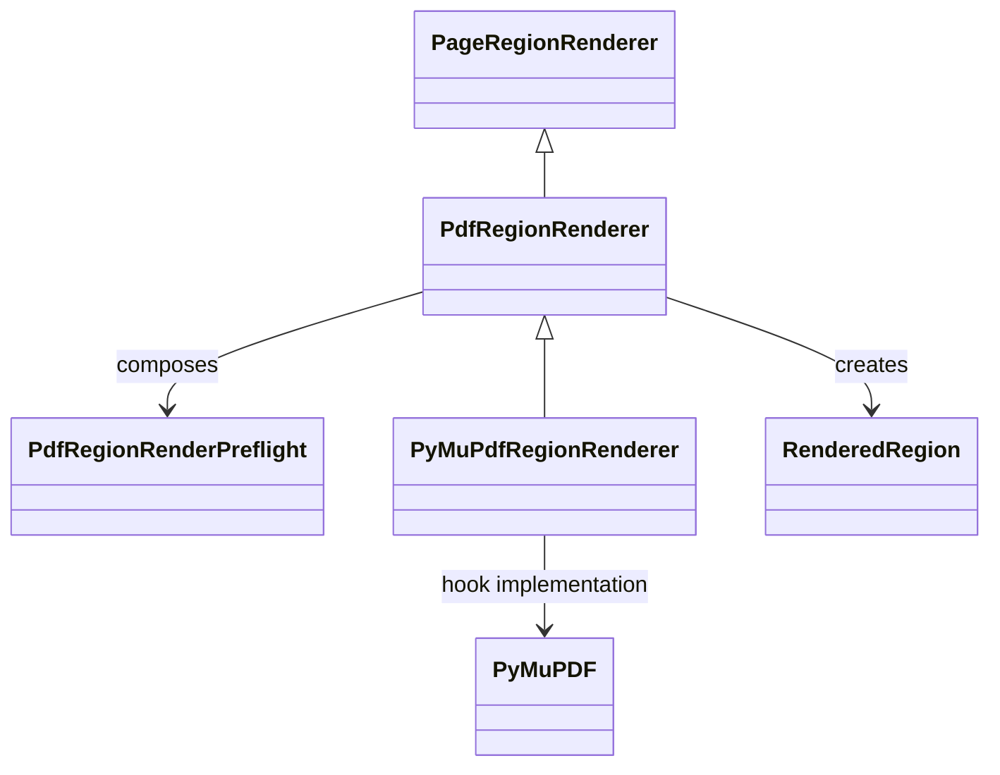

# `PyMuPdfRegionRenderer` schematic

The PDF base owns the template workflow and domain result. The concrete adapter
implements only backend lifecycle, geometry, identity, raster, and encoding
hooks.
