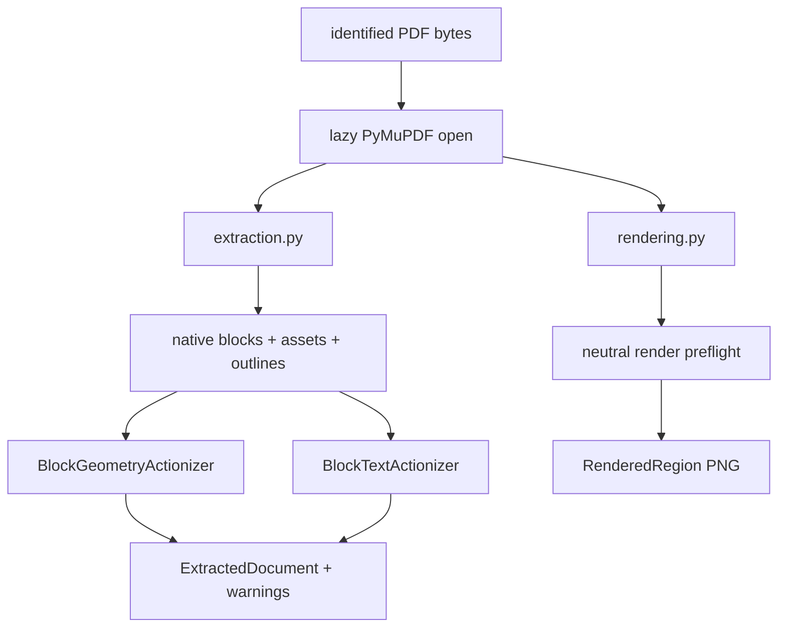

# `pdf.adapters.pymupdf` schematic

```mermaid
flowchart TD
    Source["identified PDF bytes"] --> Open["lazy PyMuPDF open"]
    Open --> Extract["extraction.py"]
    Open --> Render["rendering.py"]
    Extract --> Raw["native blocks + assets + outlines"]
    Raw --> Geometry["BlockGeometryActionizer"]
    Raw --> Text["BlockTextActionizer"]
    Geometry --> Document["ExtractedDocument + warnings"]
    Text --> Document
    Render --> Preflight["neutral render preflight"]
    Preflight --> PNG["RenderedRegion PNG"]
```

Concrete backend objects do not cross into the neutral extraction actions or
renderer results.
