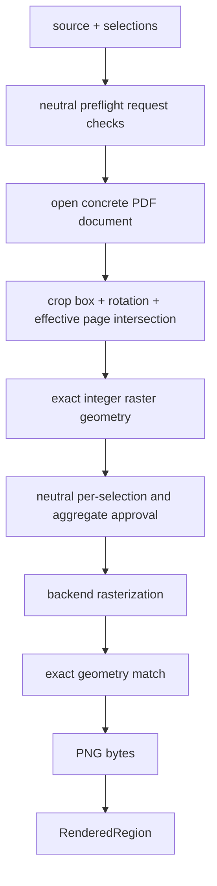

# `pdf.adapters.pymupdf` schematic

No raster allocation occurs until all unique selections have approved plans.
Requested ordering and duplicates are reconstructed from the rendered unique
selection map.
