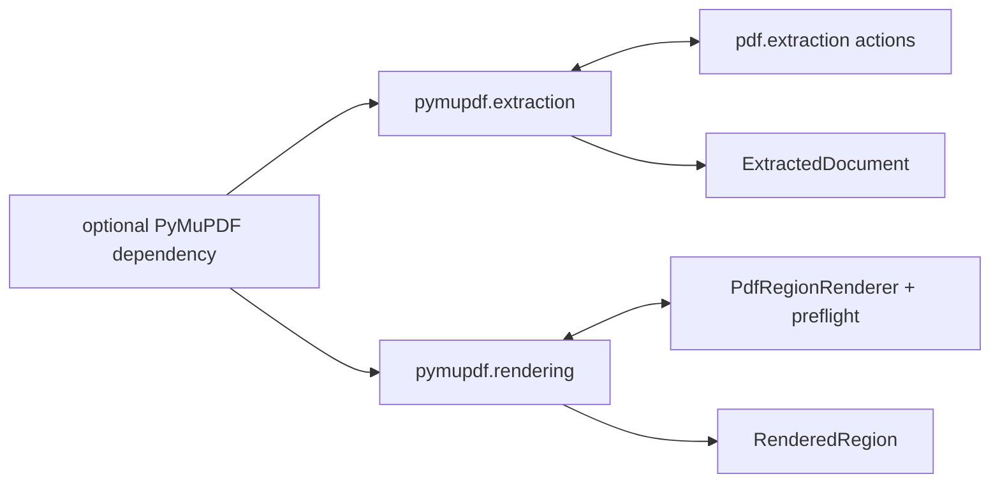

# `projectkoios.ingestion.pdf.adapters` schematic

```mermaid
flowchart LR
    Backend["optional PyMuPDF dependency"]
    Extraction["pymupdf.extraction"]
    Rendering["pymupdf.rendering"]
    NeutralExtraction["pdf.extraction actions"]
    NeutralRender["PdfRegionRenderer + preflight"]
    Document["ExtractedDocument"]
    Region["RenderedRegion"]

    Backend --> Extraction
    Backend --> Rendering
    Extraction <--> NeutralExtraction
    Rendering <--> NeutralRender
    Extraction --> Document
    Rendering --> Region
```
