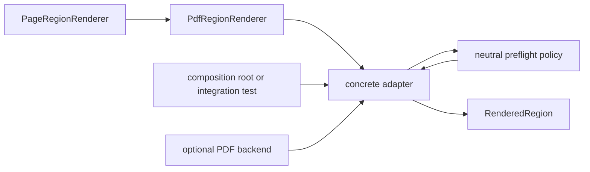

# `projectkoios.ingestion.pdf.adapters` schematic

Composition roots choose concrete adapters. Adapters own backend translation
and execution while the nominal bases and preflight retain neutral contracts
and policy.
