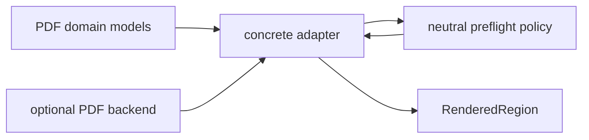

# `projectkoios.ingestion.pdf.adapters` schematic

```mermaid
flowchart LR
    Models["PDF domain models"]
    Backend["optional PDF backend"]
    Adapter["concrete adapter"]
    Preflight["neutral preflight policy"]
    Result["RenderedRegion"]

    Models --> Adapter
    Backend --> Adapter
    Adapter --> Preflight
    Preflight --> Adapter
    Adapter --> Result
```

Adapters own backend translation and execution while preflight remains the
single owner of request validation and allocation limits.
