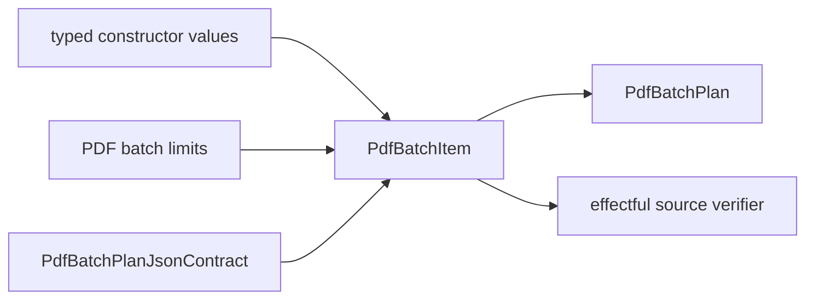

# `pdf.batch.item` schematic

```mermaid
flowchart LR
    Values["typed constructor values"]
    Limits["PDF batch limits"]
    Item["PdfBatchItem"]
    Json["PdfBatchPlanJsonContract"]
    Plan["PdfBatchPlan"]
    Verifier["effectful source verifier"]

    Values --> Item
    Limits --> Item
    Json --> Item
    Item --> Plan
    Item --> Verifier
```

The item validates one declaration but performs no JSON parsing, source reads,
hashing, extraction, or publication.
