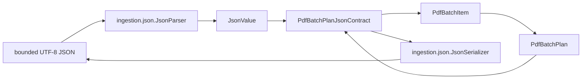

# `pdf.batch.json` schematic

The generic JSON package owns safe mechanics. The PDF batch specialization owns
only field schema, record reconstruction, formatting selection, and domain error
translation.
