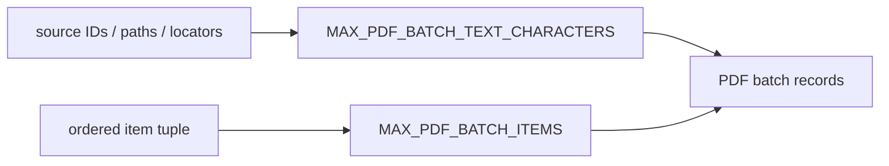

# `pdf.batch.limits.definition` schematic

```mermaid
flowchart LR
    Text["source IDs / paths / locators"]
    Items["ordered item tuple"]
    TextLimit["MAX_PDF_BATCH_TEXT_CHARACTERS"]
    ItemLimit["MAX_PDF_BATCH_ITEMS"]
    Records["PDF batch records"]

    Text --> TextLimit --> Records
    Items --> ItemLimit --> Records
```

The constants bound retained record content independently of JSON formatting.
