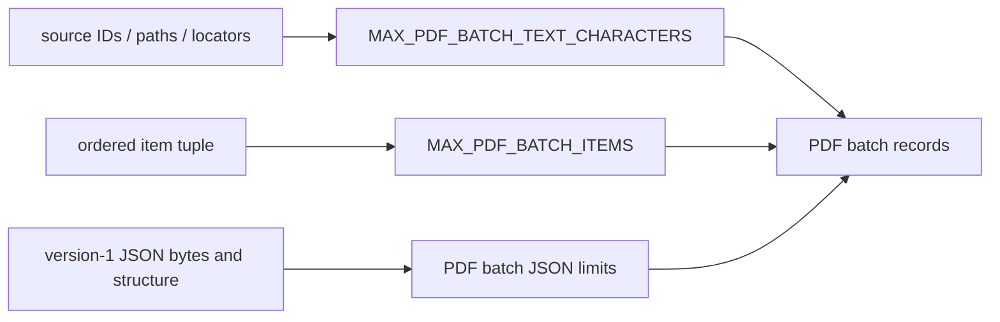

# `pdf.batch.limits.definition` schematic

```mermaid
flowchart LR
    Text["source IDs / paths / locators"]
    Items["ordered item tuple"]
    TextLimit["MAX_PDF_BATCH_TEXT_CHARACTERS"]
    ItemLimit["MAX_PDF_BATCH_ITEMS"]
    Records["PDF batch records"]
    Wire["version-1 JSON bytes and structure"]
    WireLimits["PDF batch JSON limits"]

    Text --> TextLimit --> Records
    Items --> ItemLimit --> Records
    Wire --> WireLimits --> Records
```

The record constants bound retained content independently of JSON formatting;
the wire constants bound parsing and serialization resources.
