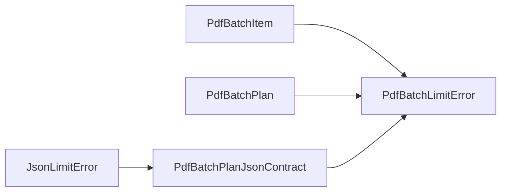

# `pdf.batch.limits.error` schematic

```mermaid
flowchart LR
    Item["PdfBatchItem"]
    Plan["PdfBatchPlan"]
    JsonLimit["JsonLimitError"]
    Contract["PdfBatchPlanJsonContract"]
    Error["PdfBatchLimitError"]

    Item --> Error
    Plan --> Error
    JsonLimit --> Contract --> Error
```

The domain error classifies PDF-batch resource exhaustion without absorbing
generic parser ownership.
