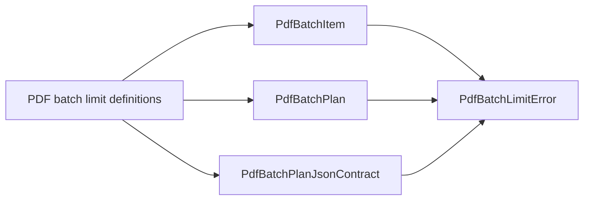

# `pdf.batch.limits` schematic

```mermaid
flowchart LR
    Definition["PDF batch limit definitions"]
    Item["PdfBatchItem"]
    Plan["PdfBatchPlan"]
    Error["PdfBatchLimitError"]
    Json["PdfBatchPlanJsonContract"]

    Definition --> Item
    Definition --> Plan
    Definition --> Json
    Item --> Error
    Plan --> Error
    Json --> Error
```

Record ceilings remain PDF-batch-owned; generic JSON safety ceilings remain in
`ingestion.json.limits`.
