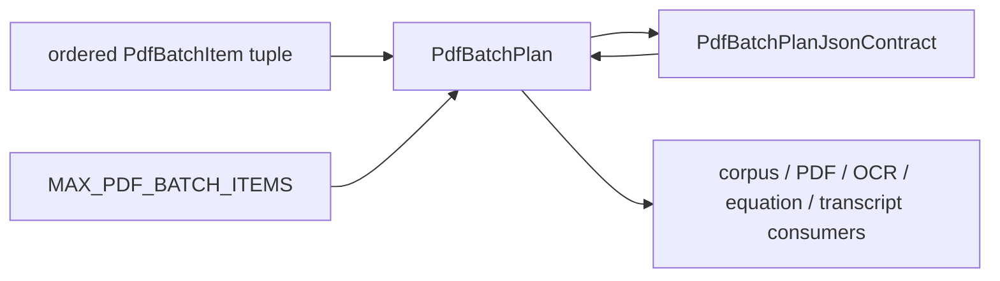

# `pdf.batch.plan` schematic

```mermaid
flowchart LR
    Items["ordered PdfBatchItem tuple"]
    Limits["MAX_PDF_BATCH_ITEMS"]
    Plan["PdfBatchPlan"]
    Json["PdfBatchPlanJsonContract"]
    Consumers["corpus / PDF / OCR / equation / transcript consumers"]

    Items --> Plan
    Limits --> Plan
    Json --> Plan
    Plan --> Json
    Plan --> Consumers
```

The plan owns typed ordering and uniqueness. The JSON specialization owns wire
shape and bytes; consumers own external verification and execution.
