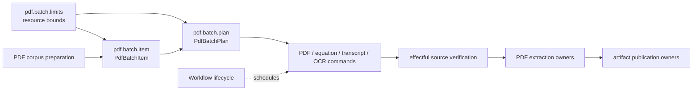

# `projectkoios.ingestion.pdf.batch` schematic

The item and plan are immutable portable input records. They declare source
checksums and relative targets but perform no I/O. Commands and other effectful
owners verify external state before extraction or publication. Workflow may
schedule a command as a prototask but does not become part of the plan record.
