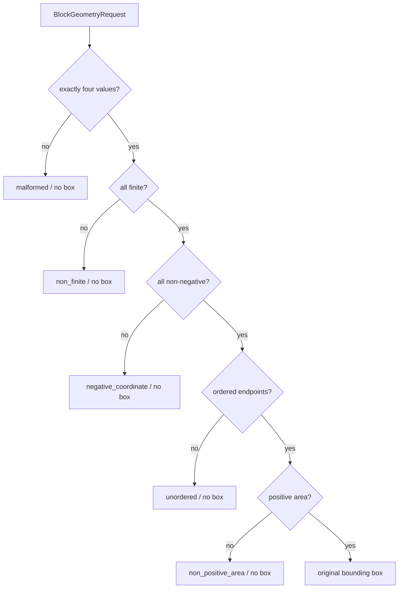

# `pdf.extraction.geometry` schematic

```mermaid
flowchart TD
    Request["BlockGeometryRequest"] --> Shape{"exactly four values?"}
    Shape -- no --> Malformed["malformed / no box"]
    Shape -- yes --> Finite{"all finite?"}
    Finite -- no --> NonFinite["non_finite / no box"]
    Finite -- yes --> NonNegative{"all non-negative?"}
    NonNegative -- no --> Negative["negative_coordinate / no box"]
    NonNegative -- yes --> Ordered{"ordered endpoints?"}
    Ordered -- no --> Unordered["unordered / no box"]
    Ordered -- yes --> Area{"positive area?"}
    Area -- no --> Degenerate["non_positive_area / no box"]
    Area -- yes --> Valid["original bounding box"]
```
