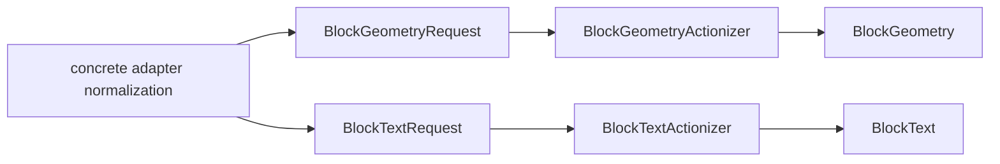

# `pdf.extraction` schematic

```mermaid
flowchart LR
    Adapter["concrete adapter normalization"]
    GeometryRequest["BlockGeometryRequest"]
    GeometryAction["BlockGeometryActionizer"]
    GeometryResult["BlockGeometry"]
    TextRequest["BlockTextRequest"]
    TextAction["BlockTextActionizer"]
    TextResult["BlockText"]

    Adapter --> GeometryRequest --> GeometryAction --> GeometryResult
    Adapter --> TextRequest --> TextAction --> TextResult
```

Every request and result is immutable and replayable. Backend execution remains
outside the package.
